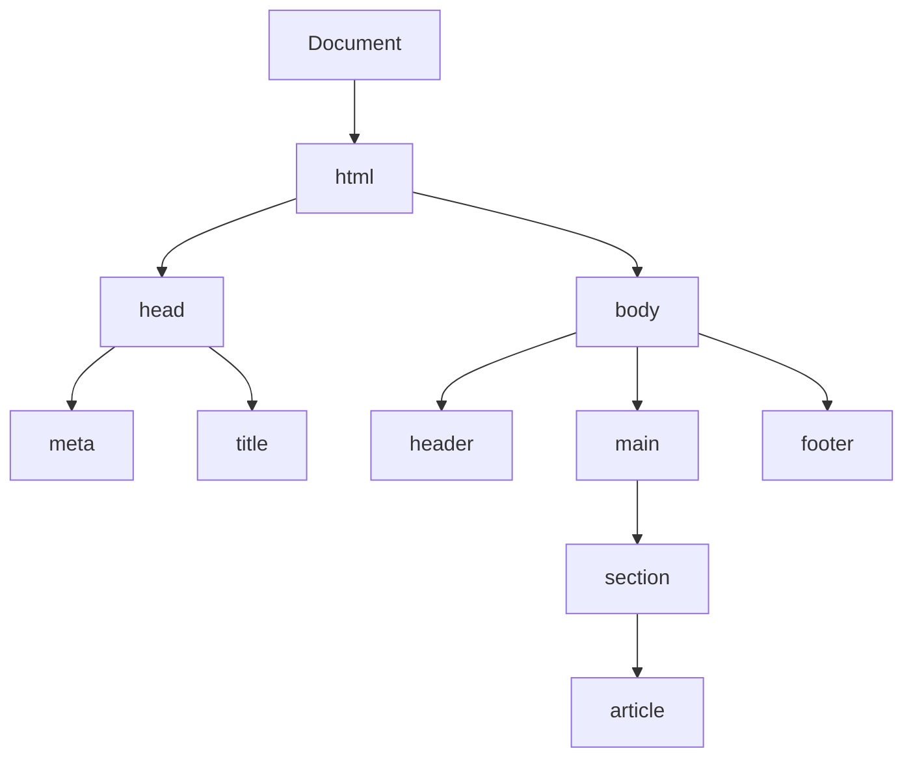

# Schéma — Arbre du document

```mermaid
graph TD
  D[Document] --> H[html]
  H --> HEAD[head]
  H --> BODY[body]
  HEAD --> META[meta]
  HEAD --> TITLE[title]
  BODY --> HEADER[header]
  BODY --> MAIN[main]
  BODY --> FOOTER[footer]
  MAIN --> SECTION[section]
  SECTION --> ARTICLE[article]
```

Chaque élément possède une place dans une hiérarchie. Cette hiérarchie sera ensuite manipulée par le DOM.
