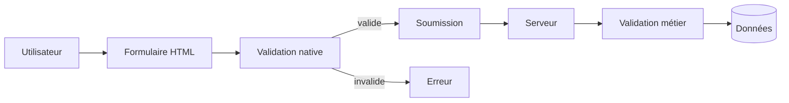

# Schéma — Flux d'un formulaire

```mermaid
flowchart LR
  U[Utilisateur] --> F[Formulaire HTML]
  F --> V[Validation native]
  V -->|valide| S[Soumission]
  V -->|invalide| E[Erreur]
  S --> B[Serveur]
  B --> BV[Validation métier]
  BV --> DB[(Données)]
```

La validation côté navigateur améliore l'expérience ; elle ne remplace jamais la validation côté serveur.
