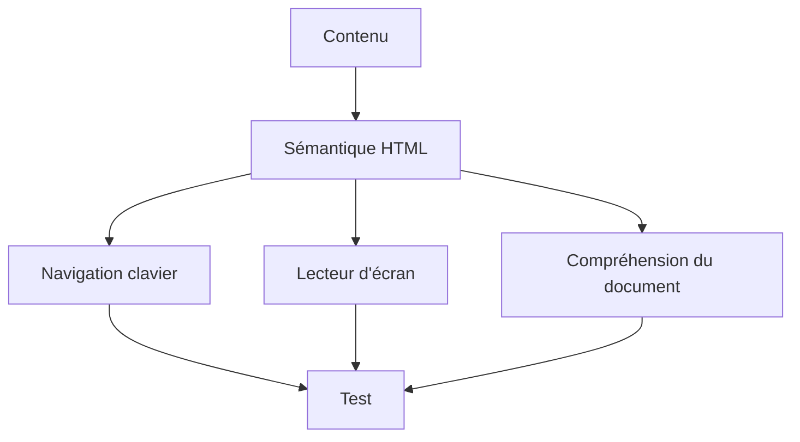

# Schéma — Parcours accessible

```mermaid
flowchart TD
  C[Contenu] --> S[Sémantique HTML]
  S --> K[Navigation clavier]
  S --> R[Lecteur d'écran]
  S --> SEO[Compréhension du document]
  K --> T[Test]
  R --> T
  SEO --> T
```

L'accessibilité commence dans la structure HTML, avant les améliorations visuelles.
