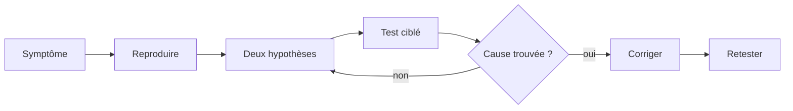

# Schéma — Diagnostic HTML

```mermaid
flowchart LR
  A[Symptôme] --> B[Reproduire]
  B --> C[Deux hypothèses]
  C --> D[Test ciblé]
  D --> E{Cause trouvée ?}
  E -->|non| C
  E -->|oui| F[Corriger]
  F --> G[Retester]
```

Ne change pas plusieurs variables simultanément : sinon tu ne sais pas quelle modification a résolu le problème.
